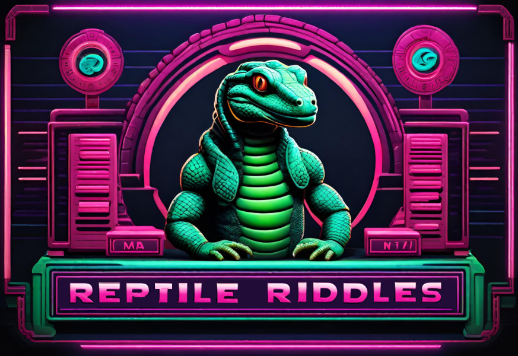

<br />
<div align="center">
  <a href="https://github.com/CodecoolGlobal/el-proyecte-grande-sprint-1-java-Tomocza">
    
  </a>
</div>
<h3 align="center">Reptile Riddles</h3>
<p align="left"></p>

## About The Project

QuizBlast is a dynamic, full-stack web application designed to ignite the fun in learning through interactive quizzes. Users like you can:

- Become a Quiz Master: Craft compelling quizzes with ease. Add questions, set difficulty levels, and choose from various question types, including multiple choice, true/false, and open-ended. Edit and refine your quizzes anytime to keep them fresh and engaging.
- Challenge and Connect: Share your quizzes with friends, classmates, or colleagues. Invite them to test their knowledge. Witness your creativity come alive as others answer your questions and strive for the top spot.

<!-- TABLE OF CONTENTS -->
<details>
  <summary>Table of Contents</summary>
  <ol>
    <li>
      <a href="#about-the-project">About The Project</a>
      <ul>
        <li><a href="#built-with">Built With</a></li>
      </ul>
    </li>
    <li>
      <a href="#getting-started">Getting Started</a>
      <ul>
        <li><a href="#installation">Installation</a></li>
      </ul>
    </li>
  </ol>
</details>


<!-- ABOUT THE PROJECT -->


## Built with

### Frontend:

![React] <br/> ![Tailwind] <br/> ![JavaScript] <br/>

### Backend: <br/>

![Java] <br/> ![SpringBoot]<br/> ![psql]

<p align="right">(<a href="#about-the-project">back to top</a>)</p>


## Usage

This application is a dockerized monolith.
Once you have the docker CLI installed, running the project will only take one command.

1. Install docker
2. Navigate to the project root
3. Run the project:
```shell
$ docker compose up
```

## User stories

1. As a new user, I want to choose my own username and password during registration, so that I can personalize my login credentials.
2. As a user, I want an option to stay logged in, so that I don’t have to enter my credentials every time.

3. As a quiz master, I want to create quizzes so that I can invite others to play.
4. As a quiz master, I want to select one correct answer for each question so that it is clear if a player got it right or not.
5. As a quiz master, I want to add more answer options to each question so that I can create a versatile quiz.
6. As a quiz master, I want to set the time players have to answer each question so that I can configure the difficulty of the questions.
7. As a quiz master, I want to make modifications to quizzes I had created so that I can make my quizzes better.
8. As a quiz master, I want to delete a quiz so that I can keep my dashboard clean.
9. As a quiz master, I want to use my fellow quiz masters' quizzes so that I have more options to organize games.
10. As a quiz master, I want to open a lobby for a quiz so that players can see what is about to be played and they can join in.
11. As a quiz master, I want to see the results when the game ends so that I can reward the winner.

12. As a player, I want to play quizzes so that I can compete against others.
13. As a player, I want to see what games accept players so that I can choose which one to join.

<p align="right">(<a href="#about-the-project">back to top</a>)</p>


<!-- MARKDOWN LINKS & IMAGES -->
<!-- https://www.markdownguide.org/basic-syntax/#reference-style-links -->

[Tailwind]: https://img.shields.io/badge/Tailwind-000000?style=for-the-badge&logo=TailwindCSS

[JavaScript]: https://img.shields.io/badge/JavaScript-000000?style=for-the-badge&logo=JavaScript

[React]: https://img.shields.io/badge/React-000000?style=for-the-badge&logo=React

[Java]: https://img.shields.io/badge/Java-000000?style=for-the-badge&logo=openjdk

[SpringBoot]: https://img.shields.io/badge/SpringBoot-000000?style=for-the-badge&logo=SpringBoot

[psql]: https://img.shields.io/badge/postgresql-000000?style=for-the-badge&logo=postgresql

[Github Pages]: https://img.shields.io/badge/github-121013?style=for-the-badge&logo=github&logoColor=white

[Gmail]: https://img.shields.io/badge/Gmail-D14836?style=for-the-badge&logo=gmail&logoColor=white

[LinkedIn]: https://img.shields.io/badge/LinkedIn-0077B5?style=for-the-badge&logo=linkedin&logoColor=white
